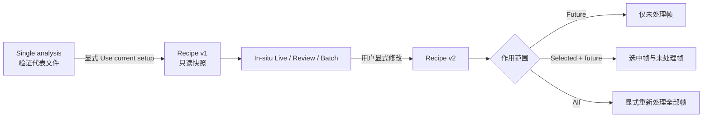

# In-situ 序列分析契约

- **Status**: Current
- **Scope**: Fitting 中单文件分析与实时、回看、批量序列处理之间的配置和数据边界
- **Related code**:
  [`src/gimap/features/fitting/domain/insitu_recipe.py`](../../src/gimap/features/fitting/domain/insitu_recipe.py)、
  [`src/gimap/features/fitting/application/insitu_recipe.py`](../../src/gimap/features/fitting/application/insitu_recipe.py)、
  [`src/gimap/features/fitting/application/insitu.py`](../../src/gimap/features/fitting/application/insitu.py)、
  [`src/gimap/features/fitting/infrastructure/adapters/local_files.py`](../../src/gimap/features/fitting/infrastructure/adapters/local_files.py)
- **Related tests**:
  [`tests/test_fitting_insitu_recipe.py`](../../tests/test_fitting_insitu_recipe.py)、
  [`tests/test_fitting_insitu_workflow.py`](../../tests/test_fitting_insitu_workflow.py)、
  [`tests/test_fitting_file_use_cases.py`](../../tests/test_fitting_file_use_cases.py)
- **Last verified**: 2026-08-25

## 设计结论

Fitting 是一个 workspace，包含两个稳定、互不抢占状态的工作上下文：

```text
Fitting
├── Single analysis    单个代表文件的交互式分析与参数验证
└── In-situ series     使用已确认 Recipe 进行 Live / Review / Batch
```

In-situ 不是一套不同的科学算法。每一帧仍按单文件的预处理、几何、cut 和 fitting use case
执行；In-situ 只增加文件发现、序列调度、Recipe 版本、失败策略、进度和结果聚合。

## 单向 Recipe 快照



- 传递必须由用户显式触发，不得因为单文件参数改变而自动改写正在运行的序列；
- Recipe 创建后是不可变快照。In-situ 中的编辑生成下一版本，不原地修改旧版本；
- In-situ 的修改不得反向覆盖 Single analysis；
- Recipe 更新必须显示作用范围。默认是 `future`，不会静默重算已完成帧；
- `all` 意味着显式重新处理，不是单纯改变显示；
- Recipe 和 worker message 都必须是 JSON 可序列化数据，不得包含 QWidget、NumPy array、
  TensorFlow/BornAgain object 或 file handle。

## Recipe 内容

Recipe 记录影响科学结果的配置，而不是窗口布局或颜色等显示偏好：

| 分组 | 内容 | 序列中的常见策略 |
| --- | --- | --- |
| Experiment setup | detector distance、pixel size、beam center、wavelength、grazing angle | 通常固定 |
| Preprocessing | orientation、threshold/mask、mirror-fill | 固定并应用到每一帧 |
| Cut | ROI、cut geometry、q/像素定义 | 固定或按追踪策略更新 |
| Model | components、global 参数、constraints、fit profile | 固定定义，初值可继承 |
| Tracking | center/Yoneda 如何随帧变化 | fixed / detect each frame / previous success |
| Fitting | 初值、refinement 频率、失败策略 | recipe / previous / AI；continue / stop |

Colormap、vmin/vmax、zoom、当前标签页等 `DisplayState` 不进入 Recipe，因为它们不改变科学输入。

## 三种工作模式

- **Live monitor**：递归监视 acquisition root。CBF 中每个文件是一帧；NXS 中同名前缀的 module
  files 组成一个逻辑 detector sequence，内部 dataset 的每个 frame 是一帧。帧稳定后进入队列，
  只使用当时生效的 Recipe 版本；
- **Review history**：回看已处理文件、状态、参数和趋势。默认不重新计算；显式 reprocess 才产生新结果；
- **Batch process**：先确定文件集合和顺序，再使用一个 Recipe 执行。可暂停、取消、失败继续并恢复状态。

三种模式共享同一 Recipe、JobStatus、结果表和预览语义，不得分别复制预处理或拟合算法。

## 页面与操作模型

In-situ 页面是序列处理的唯一 UI owner。Single analysis 的 Load Mode 只负责单文件或临时
Stack，不再提供 In-situ 选项、范围输入、轮询 timer 或第二个 runner dialog。

页面使用稳定、可点击的逐帧流程：

```text
Source → Preprocess → Geometry → Yoneda & cut → Fit → Results
```

- 点击节点只切换该步骤的参数和解释，不立即计算，也不改变当前 Preview/Frames/Log 标签；
- Source 选择 `Live Watch` 或 `Process Existing Sequence`，并显式选择 CBF 或 NXS。两者共享 root
  folder、recursive、pattern、Recipe、进度和结果缓存；NXS 还声明本次探测器预期 module 数（默认
  11），未形成完整 module group 或各 module 内部帧数不一致时不得入队；
- Live 的 seen identity 是 `(logical path, internal frame index)`，而不是单独的文件路径。因此同一
  NXS 文件内追加 frame 和新产生的另一组 NXS files 都能在后续轮询中进入队列；
- Preview 始终显示当前处理图像和 cut/fit 曲线。其 Image display 提供 auto scale、log intensity、
  vmin/vmax、colormap、center 和 cut ROI overlay；这些控件只重绘当前 preview，不进入 Recipe、
  不产生新的 AnalysisImage revision，也不触发 cut/fit 或页面跳转。Frames 按行显示每个帧在 load、preprocess、
  geometry、cut、fit 各步骤的状态；
- 选中某一帧时，流程节点显示该帧实际状态，而不是把“点击过”误认为“执行成功”；
- Start、Pause、Stop 是页面底部固定命令，不随参数节点或结果标签切换而移动；
- Trend、heatmap、export 和 cache 操作属于 Results 节点，不得建立第二套处理状态。

## 一帧不变量

任意序列帧的科学输出必须可追溯到：

```text
Source frame
  → AnalysisImage(revision)
  → CutResult(recipe_version, analysis_revision)
  → FitResult(recipe_version, cut_revision)
```

相同源数据、相同 Recipe 和相同软件/依赖版本，通过单文件或 In-situ 入口执行时应得到数值兼容
的结果。In-situ 不得绕过 canonical preprocessing，也不得重新访问未处理的原始数组来生成后续
cut 或 fit。

## 当前执行边界

Live/Batch controls、预览和状态已经内嵌到 feature-owned In-situ 页面；旧 dialog shell 已删除。
执行仍复用经过测试的单帧 preprocessing、q-space、cut 和 fitting commands，不复制科学算法。

启动时由 Recipe runtime seam 注入 Recipe 的 preprocessing 与 experiment geometry，In-situ cut
直接读取 Recipe cut geometry；任务停止、批处理完成或出错后恢复 Single 的运行时设置。Model
继续复用捕获时的单文件模型；若捕获后 Single model 已变化，启动必须拒绝并要求用户重新捕获，
不得静默使用不同模型。每个结果 record 必须记录 `recipe_version` 以及 load、preprocess、geometry、
cut、fit 的独立状态。
