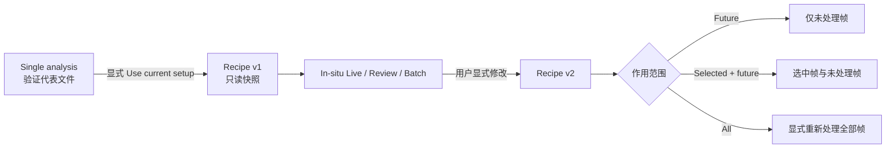

# In-situ 序列分析契约

- **Status**: Current
- **Scope**: Fitting 中单文件分析与实时、回看、批量序列处理之间的配置和数据边界
- **Related code**:
  [`src/gimap/features/fitting/domain/insitu_recipe.py`](../../src/gimap/features/fitting/domain/insitu_recipe.py)、
  [`src/gimap/features/fitting/application/insitu_recipe.py`](../../src/gimap/features/fitting/application/insitu_recipe.py)、
  [`src/gimap/features/fitting/application/insitu.py`](../../src/gimap/features/fitting/application/insitu.py)、
  [`src/gimap/features/fitting/infrastructure/adapters/local_files.py`](../../src/gimap/features/fitting/infrastructure/adapters/local_files.py)
- **Related tests**:
  [`tests/test_fitting_insitu_recipe.py`](../../tests/test_fitting_insitu_recipe.py)、
  [`tests/test_fitting_insitu_workflow.py`](../../tests/test_fitting_insitu_workflow.py)、
  [`tests/test_fitting_file_use_cases.py`](../../tests/test_fitting_file_use_cases.py)
- **Last verified**: 2026-09-22

## 设计结论

Fitting 是一个 workspace，包含两个稳定、互不抢占状态的工作上下文：

```text
Fitting
├── Single analysis    单个代表文件的交互式分析与参数验证
└── In-situ series     使用已确认 Recipe 进行 Live / Review / Batch
```

In-situ 不是一套不同的科学算法。每一帧仍按单文件的预处理、几何、cut 和 fitting use case
执行；In-situ 只增加文件发现、序列调度、Recipe 版本、失败策略、进度和结果聚合。

## 单向 Recipe 快照


```mermaid
flowchart LR
    A["Single analysis\n验证代表文件"] -->|"显式 Use current setup"| B["Recipe v1\n只读快照"]
    B --> C["In-situ Live / Review / Batch"]
    C -->|"用户显式修改"| D["Recipe v2"]
    D --> E{"作用范围"}
    E -->|"Future"| F["仅未处理帧"]
    E -->|"Selected + future"| G["选中帧与未处理帧"]
    E -->|"All"| H["显式重新处理全部帧"]
```

- 传递必须由用户显式触发，不得因为单文件参数改变而自动改写正在运行的序列；
- Recipe 创建后是不可变快照。In-situ 中的编辑生成下一版本，不原地修改旧版本；
- In-situ 的修改不得反向覆盖 Single analysis；
- Recipe 更新必须显示作用范围。默认是 `future`，不会静默重算已完成帧；
- `all` 意味着显式重新处理，不是单纯改变显示；
- Recipe 和 worker message 都必须是 JSON 可序列化数据，不得包含 QWidget、NumPy array、
  TensorFlow/BornAgain object 或 file handle。

## Recipe 内容

Recipe 记录影响科学结果的配置，而不是窗口布局或颜色等显示偏好：

| 分组 | 内容 | 序列中的常见策略 |
| --- | --- | --- |
| Experiment setup | detector distance、pixel size、beam center、wavelength、grazing angle | 通常固定 |
| Preprocessing | orientation、threshold/mask、mirror-fill | 固定并应用到每一帧 |
| Cut | ROI、cut geometry、q/像素定义 | 固定或按追踪策略更新 |
| Model | workflow_v5 方法、幅度校准开关、条件、组分、分辨率、噪声、候选预算及输入 ROI/侧选择 | 捕获快照；不跟随 Single 修改 |
| Tracking | center/Yoneda 如何随帧变化 | fixed / detect each frame / previous success |
| Fitting | Fit curves · selected method / legacy correction off / Extract only；失败策略 | 实际方法以捕获的 Fit method 为准；RC specialist 独立控制幅度校准；continue / stop |

Colormap、vmin/vmax、zoom、当前标签页等 `DisplayState` 不进入 Recipe，因为它们不改变科学输入。

Experiment setup 必须保存用于 q 网格计算的完整科学精度。当 spinbox 只是该值的舍入显示时，
捕获读取设置仓库中的原值；有意修改到不同显示值时采用用户输入。不得将优化后的
Center X 791.3190849 因界面显示 791.32 而变成另一套几何，也不得通过扩大 ROI 掩盖由此导致
的边界点丢失。Single／in-situ 同帧需保留相同原生 q、观测强度、有效像素计数和输入 ROI。

## 三种工作模式

- **Live monitor**：递归监视 acquisition root。CBF 中每个文件是一帧；NXS 中同名前缀的 module
  files 组成一个逻辑 detector sequence，内部 dataset 的每个 frame 是一帧。帧稳定后进入队列，
  只使用当时生效的 Recipe 版本；
- **Review history**：回看已处理文件、状态、参数和趋势。默认不重新计算；显式 reprocess 才产生新结果；
- **Batch process**：先确定文件集合和顺序，再使用一个 Recipe 执行。可暂停、取消、失败继续并恢复状态。

三种模式共享同一 Recipe、JobStatus、结果表和预览语义，不得分别复制预处理或拟合算法。

## 页面与操作模型

In-situ 页面是序列处理的唯一 UI owner。Single analysis 的 Load Mode 只负责单文件或临时
Stack，不再提供 In-situ 选项、范围输入、轮询 timer 或第二个 runner dialog。

页面只保留三个可点击的步骤；Analysis settings 的 Detector / cut settings 折叠区保留预处理、几何与 cut 参数：

```text
Source → Analysis settings → Results
```

- 点击节点只切换该步骤的参数和解释，不立即计算，也不改变当前 Preview/Frames/Log 标签；
- Source 选择 `Live Watch` 或 `Process Existing Sequence`，并显式选择 CBF 或 NXS。两者共享 root
  folder、recursive、pattern、Recipe、进度和结果缓存；NXS 还声明本次探测器预期 module 数（默认
  11），未形成完整 module group 或各 module 内部帧数不一致时不得入队；
- Live 的 seen identity 是 `(logical path, internal frame index)`，而不是单独的文件路径。因此同一
  NXS 文件内追加 frame 和新产生的另一组 NXS files 都能在后续轮询中进入队列；
- Preview 始终显示当前处理图像和 cut/fit 曲线。其 Image display 提供 auto scale、log intensity、
  vmin/vmax、colormap、center 和 cut ROI overlay；这些控件只重绘当前 preview，不进入 Recipe、
  不产生新的 AnalysisImage revision，也不触发 cut/fit 或页面跳转。Frames 按行显示每个帧在 load、preprocess、
  geometry、cut、fit 各步骤的状态；
- 选中某一帧时，流程节点显示该帧实际状态，而不是把“点击过”误认为“执行成功”；
- Start、Pause、Stop 是页面底部固定命令，不随参数节点或结果标签切换而移动；
- Trend、heatmap、export 和 cache 操作属于 Results 节点，不得建立第二套处理状态。

## 一帧不变量

任意序列帧的科学输出必须可追溯到：

```text
Source frame
  → AnalysisImage(revision)
  → CutResult(recipe_version, analysis_revision)
  → FitResult(recipe_version, cut_revision)
```

相同源数据、相同 Recipe 和相同软件/依赖版本，通过单文件或 In-situ 入口执行时应得到数值兼容
的结果。In-situ 不得绕过 canonical preprocessing，也不得重新访问未处理的原始数组来生成后续
cut 或 fit。

## 当前执行边界

Live/Batch controls、预览和状态已经内嵌到 feature-owned In-situ 页面；旧 dialog shell 已删除。
执行仍复用经过测试的单帧 preprocessing、q-space、cut 和 fitting commands，不复制科学算法。

启动时由 Recipe runtime seam 注入 Recipe 的 preprocessing 与 experiment geometry，In-situ cut
直接读取 Recipe cut geometry；任务停止、批处理完成或出错后恢复 Single 的运行时设置。1D fitting
使用 Recipe 中保存的 workflow_v5 与输入选择；Single 后续修改不会影响序列。
1D parameters 保存后生成作用于未来帧的新 Recipe，不修改 Single 设置。每个结果 record 必须记录 `recipe_version` 以及 load、preprocess、geometry、
cut、fit 的独立状态。

## 实验性预测执行与输出

单条、文本 batch 和 in-situ 共用 `infrastructure/adapters/workflow_v5.py`。
默认恢复为 **General V5 (experimental)**，使用原多组分候选网络；恢复默认不代表其拟合不足或
泛化问题已经解决。此前将局部单 RC 设为默认 Stable 的定位撤回。该分支保留为 **Single RC
specialist (experimental)**，只在 Recipe 显式 `components=[2]` 且原生 CBF 计数／q 范围适用时
使用神经快速路径；不能把未知组分 Auto 当作已知单 RC。

该局部分支默认校准粒子、背景和分辨函数线性幅度，固定形状参数；`amplitude_calibration`
独立于 General V5 的 `numerical` 四步校正。已有方法选择与 Recipe 不强制改写，内部方法键
`stable` 仅为兼容旧记录。通过 **1D parameters…** 检查方法和完整组分，再保存未来帧 Recipe。

RC specialist 下的 Auto／`[]` 组分、没有原生计数契约的文本、固定任一分辨率、非单 RC 完整先验、改变计数条件的 threshold／
镜像替换／stack、超出已验证 q／计数范围、快速曲线出现结构残差或模型不可用时，自动转遵守
用户先验的数值拟合。Auto 回退只比较单组分族；指定组合时保留完整组合，最多四组分及重复类型。
宽范围回退仍使用历史 V5 求积，不继承局部收敛正演的验证结论。Stage 与回退原因必须随结果保存。
局部单 RC 候选不表示通用组分识别、多参数模式完整覆盖或概率后验；Auto 数值单组分筛选也
不保证未知混合物覆盖。0.05 不是强制通过线。

正负 q 独立拟合；有符号强度与原测量点保留，500 点仅用于显示正演。每点实际有效像素数随
CBF cut 传递，并按完全相同的 ROI／删点／分侧排序同步；不能从加入容差后的 sigma 反推。
每帧保存两侧各自 rank 1 的曲线与候选参数，不用旧手工 forward 重新计算。
Recipe 版本、结果目录、耗时与误差写入帧记录。不同侧参数带 side 前缀，避免覆盖。
文本多文件 batch 在一个进程内复用 runtime；in-situ 当前仍按帧启动隔离 worker，存在每帧加载
开销。RC specialist 与数值回退使用 NumPy／SciPy；默认 General V5 与训练使用 TensorFlow。旧多候选
条件模型仍可显式选择，其已知条件验证不等于自动组分准确率。

2026-09-22 早期局部分支验证覆盖真实 CBF 主窗口按钮、同帧 in-situ、精确原生输入一致性、文本 batch、
取消、Recipe／调度测试及双侧结果回调。开发帧两侧观测 lnRMSE 为 0.17120／0.15523；本机
双侧 worker 计算约 0.68 s，完整 GUI 点击约 3.70 s，单帧 in-situ 约 3.07 s，三者计时范围不同。
本次范围纠正未改变权重，也未新增独立样品泛化证据；这些指标不是恢复后的 General V5 默认
方法指标。历史测试通过不证明未知组分可用，真实长序列／NXS 仍未完成全流程验收。检查命令保留为
`python tools/check_stable_predict_workflow.py --mode all`，范围与证据见
[`RELEASE_zh.md`](../../modules/Fitting_1D_Model/Workflow_v5/development/evidence/stable_blue_20260922/RELEASE_zh.md)。


## 2026-09-21 CBF 实际序列回放补充

`tools/check_cbf_center_workflow.py --insitu` 现已覆盖用户指定 CBF 的真实加载、预处理、cut、
V5 拟合、双侧输出及结果持久化（单帧序列）；长序列和 NXS 仍需单独验收。
修复 Recipe 冻结组分列表为 tuple 后被 V5 选项校验拒绝的问题；校验入口接受 list/tuple 并规范为 JSON list。
Single 的 CBF 自动 Yoneda 入口明确跳过正在运行的 in-situ，捕获后的中心/切片仍由 Recipe 决定。
