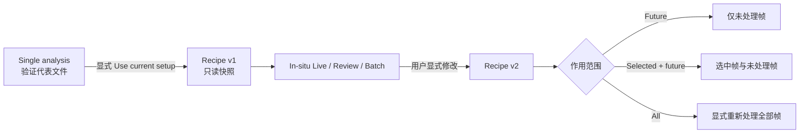

# In-situ 序列分析契约

- **Status**: Superseded in the interface (2026-10-01)：Fitting ▸ In-situ series 现在是新页面
  （`presentation/single/series_page.py` + `application/series_fit.py`，说明见
  [`../ui/workspaces/fitting.md`](../ui/workspaces/fitting.md#in-situ-series)）：直接用 Single analysis 的
  模型、两半、范围和排除的点，每帧从上一帧结果开始。下面的 Recipe 契约与代码仍在（旧页面隐藏，
  其测试照常运行），作为以后恢复 Recipe 版本记录时的参考。
- **Scope**: Fitting 中单条曲线分析与实时、批量曲线序列处理之间的配置和数据边界；探测器帧序列由
  Analyze 先转成曲线（Send Series to Fitting）
- **Related code**:
  [`src/gimap/features/fitting/domain/insitu_recipe.py`](../../src/gimap/features/fitting/domain/insitu_recipe.py)、
  [`src/gimap/features/fitting/application/insitu_recipe.py`](../../src/gimap/features/fitting/application/insitu_recipe.py)、
  [`src/gimap/features/fitting/application/insitu.py`](../../src/gimap/features/fitting/application/insitu.py)、
  [`src/gimap/features/fitting/infrastructure/adapters/local_files.py`](../../src/gimap/features/fitting/infrastructure/adapters/local_files.py)
- **Related tests**:
  [`tests/test_fitting_insitu_recipe.py`](../../tests/test_fitting_insitu_recipe.py)、
  [`tests/test_fitting_insitu_series.py`](../../tests/test_fitting_insitu_series.py)、
  [`tests/test_fitting_file_use_cases.py`](../../tests/test_fitting_file_use_cases.py)
- **Last verified**: 2026-09-28

## 设计结论

Fitting 是一个 workspace，包含两个稳定、互不抢占状态的工作上下文：

```text
Fitting
├── Single analysis    单条代表曲线的交互式拟合与参数验证
└── In-situ series     使用已确认 Recipe 拟合一个曲线序列（Live / Batch）
```

序列的每一帧是一条曲线文件（通常是 Analyze 写出的 `*_fit_input.dat`）。探测器帧的读取、
几何、gap guard、相加与切割都在 Analyze 完成（Export All / Send Series to Fitting），规则见
[`scientific-data-flow.md`](scientific-data-flow.md)。In-situ 不是一套不同的科学算法：每条曲线
仍按单条曲线的 fitting use case 执行；In-situ 只增加文件发现、序列调度、Recipe 版本、失败策略、
进度和结果聚合。

## 单向 Recipe 快照


```mermaid
flowchart LR
    A["Single analysis\n验证代表文件"] -->|"显式 Use current setup"| B["Recipe v1\n只读快照"]
    B --> C["In-situ Live / Review / Batch"]
    C -->|"用户显式修改"| D["Recipe v2"]
    D --> E{"作用范围"}
    E -->|"Future"| F["仅未处理帧"]
    E -->|"Selected + future"| G["选中帧与未处理帧"]
    E -->|"All"| H["显式重新处理全部帧"]
```

- 传递必须由用户显式触发，不得因为单文件参数改变而自动改写正在运行的序列；
- Recipe 创建后是不可变快照。In-situ 中的编辑生成下一版本，不原地修改旧版本；
- In-situ 的修改不得反向覆盖 Single analysis；
- Recipe 更新必须显示作用范围。默认是 `future`，不会静默重算已完成帧；
- `all` 意味着显式重新处理，不是单纯改变显示；
- Recipe 和 worker message 都必须是 JSON 可序列化数据，不得包含 QWidget、NumPy array、
  TensorFlow/BornAgain object 或 file handle。

## Recipe 内容

Recipe 记录影响科学结果的配置，而不是窗口布局或颜色等显示偏好：

| 分组 | 内容 | 序列中的常见策略 |
| --- | --- | --- |
| Cut | `source = "curve"`：输入是曲线文件，q 与像素数已由 Analyze 决定 | 固定 |
| Model | workflow_v5 方法、幅度校准开关、条件、组分、分辨率、噪声、候选预算及输入选择（正/负/两侧、fitting range 及其是否按 \|q\|、排除点） | 捕获快照；不跟随 Single 修改 |
| Fitting | Fit curves · selected method / legacy correction off / Plot curves only；失败策略 | 实际方法以捕获的 Fit method 为准；RC specialist 独立控制幅度校准；continue / stop |

图的色图、范围、缩放、当前标签页等显示状态不进入 Recipe，因为它们不改变科学输入。旧版 Recipe
中的 experiment setup / preprocessing / tracking 字段仍可读取，但曲线序列不再使用它们。

Single／in-situ 对同一曲线需保留相同原生 q、观测强度、有效像素计数和输入选择。

## 三种工作模式

- **Live Watch**：监视曲线文件夹（可含子文件夹），新写入的曲线（可选等到文件写完）进入队列，只使用当时
  生效的 Recipe 版本。Analyze 的 Watch + Export New Frames 写出曲线，这里接着拟合；
- **Process Existing Sequence**：按文件名自然顺序处理已有曲线（start / end / step 取文件名最后一个
  数字，忽略 `_sum10`、`_fit_input` 后缀），可暂停、取消、失败继续；
- 结果表、trend、heatmap 与导出是两种模式共用的 Results。

两种模式共享同一 Recipe、JobStatus、结果表和预览语义，不得分别复制拟合算法。

## 页面与操作模型

In-situ 页面是序列处理的唯一 UI owner；Single analysis 只处理一条曲线。页面有三个可点击的步骤：

```text
Source → Fit → Results
```

- 点击节点只切换该步骤的参数和解释，不立即计算，也不改变当前 Preview/Frames/Log 标签；
- Source 选择 `Live Watch` 或 `Process Existing Sequence`，共享曲线文件夹、pattern（默认
  `*_fit_input.dat`）、是否包含子文件夹、编号范围、Recipe、进度和结果缓存；
- Preview 显示当前曲线与拟合；Frames 按行显示每条曲线 load 与 fit 的状态；
- 选中某一帧时，流程节点显示该帧实际状态，而不是把“点击过”误认为“执行成功”；
- Start、Pause、Stop 是页面底部固定命令，不随参数节点或结果标签切换而移动；
- Trend、heatmap、export 和 cache 操作属于 Results 节点，不得建立第二套处理状态。

## 一帧不变量

任意序列帧的科学输出必须可追溯到：

```text
Detector frame(s)
  → Analyze（有效像素、gap guard、相加、几何、切割）
  → <stem>_fit_input.dat（q I σ pixels + # observation）
  → FitResult(recipe_version)
```

相同曲线、相同 Recipe 和相同软件/依赖版本，通过单条或 In-situ 入口执行时应得到数值兼容
的结果。In-situ 不读取探测器帧，也不重新计算曲线。

## 当前执行边界

Live/Batch controls、预览和状态内嵌在 feature-owned In-situ 页面。每条曲线经与 Single 相同的曲线
读取与 fitting commands 处理，不复制科学算法。1D fitting 使用 Recipe 中保存的 workflow_v5 与输入
选择；Single 后续修改不会影响序列。1D parameters 保存后生成作用于未来曲线的新 Recipe，不修改
Single 设置。每个结果 record 记录 `recipe_version` 以及 load、fit 的独立状态。

## 实验性预测执行与输出

单条、文本 batch 和 in-situ 共用 `infrastructure/adapters/workflow_v5.py`。
默认恢复为 **General V5 (experimental)**，使用原多组分候选网络；恢复默认不代表其拟合不足或
泛化问题已经解决。此前将局部单 RC 设为默认 Stable 的定位撤回。该分支保留为 **Single RC
specialist (experimental)**，只在 Recipe 显式 `components=[2]` 且原生 CBF 计数／q 范围适用时
使用神经快速路径；不能把未知组分 Auto 当作已知单 RC。

该局部分支默认校准粒子、背景和分辨函数线性幅度，固定形状参数；`amplitude_calibration`
独立于 General V5 的 `numerical` 四步校正。已有方法选择与 Recipe 不强制改写，内部方法键
`stable` 仅为兼容旧记录。通过 **1D parameters…** 检查方法和完整组分，再保存未来帧 Recipe。

RC specialist 下的 Auto／`[]` 组分、没有原生计数契约的文本、固定任一分辨率、非单 RC 完整先验、改变计数条件的 threshold／
镜像替换／stack、超出已验证 q／计数范围、快速曲线出现结构残差或模型不可用时，自动转遵守
用户先验的数值拟合。Auto 回退只比较单组分族；指定组合时保留完整组合，最多四组分及重复类型。
宽范围回退仍使用历史 V5 求积，不继承局部收敛正演的验证结论。Stage 与回退原因必须随结果保存。
局部单 RC 候选不表示通用组分识别、多参数模式完整覆盖或概率后验；Auto 数值单组分筛选也
不保证未知混合物覆盖。0.05 不是强制通过线。

正负 q 独立拟合；有符号强度与原测量点保留，500 点仅用于显示正演。每点实际有效像素数随
曲线文件的 `pixels` 列传递，并按完全相同的 ROI／删点／分侧排序同步；不能从加入容差后的 sigma 反推。
学习分支的计数契约另要求每侧 450–700 个原生列、q 覆盖到 4.0–4.3 nm⁻¹、每列 3–12 个有效像素；
不满足时按记录的原因数值回退。
每帧保存两侧各自 rank 1 的曲线与候选参数，不用旧手工 forward 重新计算。
Recipe 版本、结果目录、耗时与误差写入帧记录。不同侧参数带 side 前缀，避免覆盖。
文本多文件 batch 在一个进程内复用 runtime；in-situ 当前仍按帧启动隔离 worker，存在每帧加载
开销。RC specialist 与数值回退使用 NumPy／SciPy；默认 General V5 与训练使用 TensorFlow。旧多候选
条件模型仍可显式选择，其已知条件验证不等于自动组分准确率。

2026-09-22 早期局部分支验证覆盖真实 CBF 主窗口按钮、同帧 in-situ、精确原生输入一致性、文本 batch、
取消、Recipe／调度测试及双侧结果回调。开发帧两侧观测 lnRMSE 为 0.17120／0.15523；本机
双侧 worker 计算约 0.68 s，完整 GUI 点击约 3.70 s，单帧 in-situ 约 3.07 s，三者计时范围不同。
本次范围纠正未改变权重，也未新增独立样品泛化证据；这些指标不是恢复后的 General V5 默认
方法指标。历史测试通过不证明未知组分可用，真实长序列／NXS 仍未完成全流程验收。检查命令保留为
`python tools/check_stable_predict_workflow.py --mode all`，范围与证据见
[`RELEASE_zh.md`](../../modules/Fitting_1D_Model/Workflow_v5/development/evidence/stable_blue_20260922/RELEASE_zh.md)。

## 2026-09-28 Analyze → Fitting 回放

`tools/check_stable_predict_workflow.py` 的 UI 部分改为用户路径：Analyze 用保存的几何打开真实 CBF，
把水平带拖到验证过的行（1171–1176），Refine x by Symmetry，Send to Fitting，fitting range 设为
|q| ≤ 4.23 nm⁻¹（0.423 Å⁻¹，保留这 1148 列），然后 1D Predict；再用该曲线跑单帧 in-situ。结果：Analyze 的 1148 个原生列与
旧探测器路径的固定样本**逐列强度和像素数完全相同**，q 只差不到一列（精确 q 模型 + 对称中心
791.296 px 对旧 791.32 px），因此最靠近中心的一列换到了另一侧（570／578 对 571／577）。学习
分支可用并运行；其候选被判为结构残差，按设计转数值拟合，双侧 lnRMSE 0.166／0.148（旧记录
学习分支 0.171／0.155）。Single 与 in-situ 的原生观测与结果一致。
