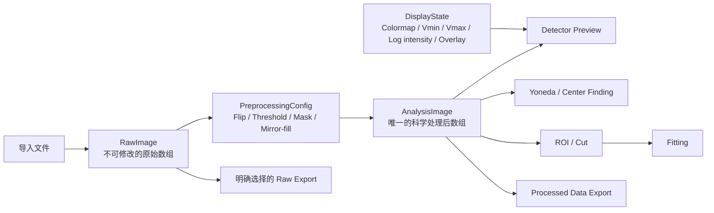
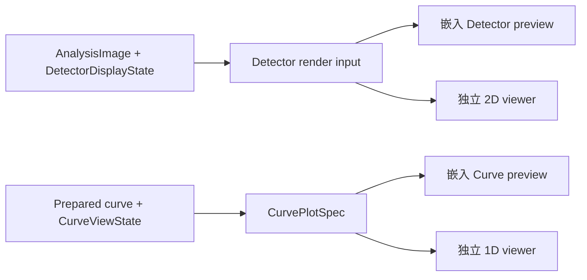
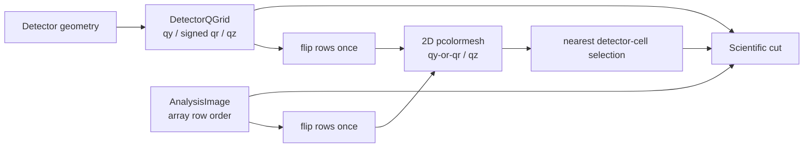
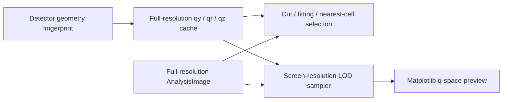

# 科学数据流契约

- **Status**: Current
- **Scope**: detector image 从导入、科学预处理、显示到派生分析结果的数据所有权与谱系
- **Related code**: `src/gimap/features/fitting/domain/detector_image.py`、
  `src/gimap/features/fitting/application/scientific.py`、
  `src/gimap/features/fitting/presentation/bindings/image_display_options.py`
- **Related tests**: `tests/test_fitting_detector_data_flow.py`、
  `tests/test_fitting_domain_image_transforms.py`、`tests/test_cut_fitting_stack.py`
- **Last verified**: 2026-08-20

## 目的

用户在 detector preview 中看到的科学预处理结果，必须与 Yoneda/center finding、ROI、cut、
fitting、batch processing 和 processed-data export 实际消费的数据一致。任何下游流程不得因为
方便或历史字段仍然存在而隐式回到刚读入的原始数组。

本契约区分科学数据和纯显示状态。不是所有可视化选项都会改变科学输入：Flip UD、threshold、
mask、detector correction 和 mirror-fill 属于 scientific preprocessing；colormap、vmin/vmax、
log intensity 和 overlay 只决定如何渲染。



## 嵌入视图与独立窗口的投影契约

独立窗口不是第二套分析工作区，也不拥有第二份 scientific/display state。它是当前嵌入视图的
放大投影，并在此基础上提供 Matplotlib toolbar、精细缩放、点排除和选区等扩展操作。



- 两个 2D 视图共享同一个 AnalysisImage revision，以及 Log/Linear、Auto scale、Vmin/Vmax、
  colormap、q/pixel axis、水平 q 坐标（`qy` 或 signed `qr`）、center 和 cut overlay 状态；任一视图
  修改这些 controls，另一视图必须同步；
- 两个 1D 视图共享同一个 `CurvePlotSpec`，包括 q preparation、data/model layers、Log X/Y、
  Normalize、q unit、Y range、ROI 和图例；禁止分别过滤、归一化或重算一套绘图数据；
- `Overlay ±q` 必须保留 source branch metadata：+q 使用蓝色，镜像后的 −q 使用红色，折叠到
  相同 `|q|` 后仍能辨认来源；
- zoom/pan 范围、窗口几何、Matplotlib toolbar mode 和临时 point-delete mode 属于单个 projection
  的 viewport state，可以只存在于独立窗口；它们不得改变 shared scientific/display state；
- 关闭和重新打开独立窗口时，必须从当前 ViewModel state 恢复，而不是从窗口自己的历史控件推断。

## Detector q 网格契约

Detector geometry 对 AnalysisImage 的每个 cell 生成同 shape 的 `qy`、`qz` 和 signed `qr` 网格：

```text
qr = sign(qy) · sqrt(qx² + qy²)
```

`qr` 是面内径向坐标，不得使用 `sqrt(qy² + qz²)` 近似。`qz` 是面外坐标，不属于 `qr`。
科学 cut 使用与 AnalysisImage array row 对齐的原始网格；Detector preview 因屏幕采用
`origin='lower'`，必须把 intensity 与两个坐标网格一起只翻转一次。禁止只翻 intensity、只翻 qz，
或使用 `[q_min, q_max]` 的 `imshow extent` 把曲线网格压成规则矩形。



- 水平坐标可选择 `qy` 或 signed `qr`，纵轴始终是 `qz`；
- 主 Detector preview 与独立 viewer 必须使用同一选择并显示同一网格；
- 点击、框选、center overlay 和 Yoneda cut region 必须吸附到最近的有限 detector cell；
- `qy ↔ qr` 或 pixel ↔ q 切换时，先保存 detector-cell bounds，再投影到新坐标，不能把旧数值直接
  当作新单位；
- 坐标切换不产生新的 AnalysisImage revision，但已有 cut 必须按同一 detector 区域刷新坐标和结果；
- 下采样 preview 时，intensity、水平 q 网格和 qz 网格必须使用相同 stride。

### q 网格缓存与显示 LOD

q 坐标分为“科学网格”和“显示网格”，两者不得混用：



- geometry fingerprint 包含 image shape、pixel size、beam center、distance、入射角和波长；只有这些
  值变化时才允许重算完整 q 网格；
- colormap、log/linear、vmin/vmax、overlay、pixel/q 显示切换和 `qy ↔ qr` 不得使完整 q 网格失效；
- 主 Detector preview 与独立 viewer 共享同一组只读完整 q 网格，不得各自重复计算或复制；
- Matplotlib 只接收与 viewport 像素数相称的 display LOD。LOD 必须同时以相同 stride 抽取 intensity、
  水平 q 和 qz；不得把显示抽样后的数组用于 cut、fitting、export 或 detector-cell snapping；
- 初次计算或 detector geometry 真正变化时允许产生一次重算。若该重算以后仍形成可感知卡顿，应通过
  worker 生成新的完整网格并在完成后原子替换，不能让 presentation 维护另一套科学结果。

## 三类状态

### RawImage

`RawImage` 是 loader 返回数据的只读快照。加载完成后不得原地修改，也不得被 scientific
preprocessing、renderer 或算法拿来复用为可写工作区。

允许读取 RawImage 的情况只有：

- 重新执行 preprocessing pipeline；
- 用户明确选择 Raw Preview 或 Raw Export；
- 有明确标识的诊断和 characterization test。

### AnalysisImage

`AnalysisImage` 是 `RawImage + PreprocessingConfig` 的确定性输出，是当前 preprocessing revision
下唯一的科学数组。以下流程默认且只能消费它：

- detector preview 的像素底图；
- Yoneda/center finding；
- ROI、pixel cut、q-space cut；
- fitting、AI fitting 和 in-situ/batch analysis；
- processed-data export。

下游代码不得在 AnalysisImage 缺失时静默回退到 RawImage。缺失应表现为明确的“尚未准备数据”
状态或结构化错误。

### DisplayState

`DisplayState` 包含 colormap、vmin/vmax、auto scale、log intensity、zoom/pan、q 轴投影、center
overlay 和 cut overlay。它由 presentation/rendering 拥有，可以与 AnalysisImage 一起传给 renderer。
其中纯颜色/viewport 选项不得：

- 修改 RawImage 或 AnalysisImage；
- 改变 Yoneda、cut 或 fitting 输入；
- 触发 cut、fit 或自动切换结果页；
- 被 application/domain 当作 scientific request。

## PreprocessingConfig

PreprocessingConfig 必须是 framework-neutral、可比较和可测试的数据。当前 fitting 至少包含：

- `flip_ud`；
- threshold 是否启用以及上下限；
- mirror-fill 是否启用、镜像中心和 gap margin。

Pipeline 每次都从 RawImage 重建 AnalysisImage，禁止在上一版 AnalysisImage 上累计 flip、mirror 或
threshold。这样可以避免重复翻转、重复填充和切换选项后无法恢复原数据。

Mirror-fill 的镜像轴属于 preprocessing input。当前 fitting 使用 Setup 中保存的 detector
`beam_center_x`，不得把正在求解的临时 Yoneda 结果作为未声明输入，从而形成循环依赖。

## Revision、失效和谱系

每次导入新数据或改变 scientific preprocessing 后，应生成新的 preprocessing revision。依赖旧
revision 的 Yoneda、cut 和 fitting 结果必须标记为 stale；改变纯 DisplayState 不生成 scientific
revision，也不得使分析结果失效。

派生结果逐步采用以下谱系：

```text
AnalysisImage(revision=N)
    → CenterResult(source_revision=N)
    → CutResult(source_revision=N)
    → FitResult(source_cut_revision=N)
```

裸数组兼容字段只能作为 AnalysisImage 的只读别名，不能形成第二套数据所有权。代码必须使用
语义明确的 data-flow API，而不是新增 `data`、`current_data` 或 `processed` 等含义不明的字段。

## Stack 和内存

RawImage 与 AnalysisImage 是逻辑上独立的数据状态，不要求无条件复制所有底层内存。实现可以在
确认只读和安全时共享 backing storage，也可以按 preprocessing revision 缓存结果。优化不得改变：

- RawImage 不可变；
- pipeline 从 raw 确定性重建；
- 下游统一读取 AnalysisImage；
- revision 与失效规则。

对于 multi-frame、stack 和 in-situ，必须明确记录 preprocessing 是逐 frame 还是聚合后执行；不得在
worker 和 GUI 进程中各自隐式执行一次相同 transform。

## 实现与 review 门禁

- Domain 拥有 preprocessing config、科学变换和 framework-neutral 数据类型；
- Application 暴露准备 AnalysisImage 的 command/use case；
- Presentation 只收集选项、保存 UI state、请求 application command 并渲染结果；
- Renderer 只能读取 AnalysisImage 和 DisplayState；
- 禁止 scientific code 调用 `_get_current_display_image()` 或其他 presentation helper；
- 禁止用 RawImage 修补某个局部 workflow；需要 raw 的例外必须在 API 名称和测试中显式表达；
- 新增 preprocessing option 时必须同时增加 pipeline、谱系和 downstream-consistency tests。

最低测试要求：

1. RawImage 在处理前后保持数值不变且不可写；
2. pipeline 顺序和重复执行确定；
3. preview、Yoneda 和 cut 消费同一 revision 的 AnalysisImage；
4. mirror-fill、flip、threshold 会进入 AnalysisImage；
5. colormap、vmin/vmax、log 和 overlay 不改变 AnalysisImage；
6. preprocessing 变化使派生结果 stale，DisplayState 变化不会；
7. Raw Export 与 Processed Export 的来源是显式且可区分的。
