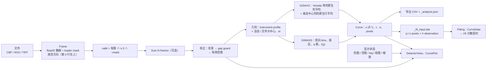

# 科学数据流契约

- **Status**: Current
- **Scope**: 探测器帧从读取、有效像素、校正、几何到曲线，再到 Fitting 的数据所有权与谱系；
  显示状态与科学数据的边界
- **Related code**: `src/gimap/shared/detector_io/`、`src/gimap/shared/geometry/`、
  `src/gimap/features/analyze/domain/`（`validity.py`、`corrections.py`、`binning.py`、`gisaxs.py`、
  `giwaxs.py`、`symmetry.py`）、`src/gimap/features/analyze/application/use_cases.py`、
  `src/gimap/features/analyze/infrastructure/adapters/csv_export.py`、
  `src/gimap/features/fitting/infrastructure/adapters/local_files.py`、
  `src/gimap/features/fitting/presentation/bindings/workflow_v5_binding.py`、
  `src/gimap/features/prediction/infrastructure/adapters/module_preprocessing.py`
- **Related tests**: `tests/test_analyze_domain.py`、`tests/test_analyze_frames_and_center.py`、
  `tests/test_analyze_fit_input_contract.py`、`tests/test_analyze_workspace.py`、
  `tests/test_stable_metadata_ui.py`、`tests/test_prediction_adapters.py`
- **Last verified**: 2026-09-28

## 目的

用户在 Analyze 中看到的曲线，必须就是导出、送到 Fitting、以及 in-situ 序列实际使用的观测。
任何下游流程不得因为方便而重新读取原始数组、另做一套掩码或插值。显示选项（色图、强度范围、
log、q map / detector 视图、缩放）只决定怎么画，不改变任何科学数值。

```mermaid
flowchart LR
    A["文件<br/>CBF / NXS / TIFF"] --> B["Frame<br/>float32 数据 + loader mask<br/>规范方向（第 0 行在上）"]
    B --> C["valid = 有限 ∧ ≥ 0 ∧ ¬mask"]
    C --> D["Sum N frames（可选）"]
    D --> E["校正：背景 → gap guard → 有效范围"]
    E --> F["几何：instrument profile<br/>+ 会话 / 文件头中心、αi"]
    F --> G["GISAXS：Yoneda 带的原生列平均<br/>+ 束流中心列的原生行平均"]
    F --> H["GIWAXS：径向 bins、扇区、q 框、I(χ)"]
    G --> I["Curve：x (Å⁻¹)、I、σ、pixels"]
    H --> I
    I --> J["导出 CSV + _analysis.json"]
    I --> K["_fit_input.dat<br/>q I σ pixels + # observation"]
    K --> L["Fitting：CurveData<br/>→ V5 计数契约"]
    M["显示状态<br/>色图 / 范围 / log / 视图 / 缩放"] --> N["DetectorView、CurvePlot"]
    E --> N
    I --> N
```

## 帧与有效像素

- `shared/detector_io` 返回规范方向的帧：像素 `(行 i, 列 j)` 覆盖 `[j, j+1] × [i, i+1]`，第 0 行在
  顶部（与 `DetectorGeometry` 一致，见 [`geometry.md`](geometry.md)）。NXS 多模块在读取时拼接；
  不再有 Flip UD、mirror fill 或 threshold 这类会改写数据的预处理。
- `valid_pixels(data, mask)`：有限、非负、且不在 loader mask 中的像素才是观测。Pilatus / Eiger 的
  缝隙与坏点是负值，NeXus loader 把拒绝的像素变成 NaN，两者在这里统一。正常零计数保留。
- `sum_frames`：Sum N frames 逐像素相加，像素只有在所有帧中都有效才有效（不用部分帧外推）。

## 校正（顺序固定，均为可选或可设为 0）

1. 背景：`frame − scale × background`，两帧都有效的像素才有效；背景帧按文件版本缓存一次。
2. gap guard：`guard_invalid(valid, N)` 把探测器无效像素周围 N px（方形邻域，默认 3，0 关闭，最多 20）
   也视为无效；帧边界不算无效。它只针对探测器无效像素，不针对后续的有效范围。
3. 有效原始强度范围 Min / Max（饱和、热像素）。

校正从原始帧重新计算，不在上一版结果上累加；改变校正不重新读取文件。原始 `raw_data / raw_valid`
与校正后的 `data / valid` 分开保存在 `FrameAnalysis` 中。

## 几何与 q

几何只来自 instrument profile（标定或手动输入），会话中心、文件头中心（设置中打开时）与 αi 只替换
各自的字段。q 由 `shared/geometry` 的精确掠入射公式给出，单位 Å⁻¹；Analyze 不使用任何历史近似。
GISAXS / GIWAXS 由最大散射角自动判断（≤ 20° 为 GISAXS），也可强制。
Refine x by Symmetry 只在当前水平带内求左右对称轴并改会话中心 x，不改数据。

## 曲线

- GISAXS 水平切线：Yoneda 带（自动定位或用户拖动的行区间）中**每个探测器列**一个点——该列有效
  像素的平均强度、Poisson 标准误差 `σ = √max(Σ, 1) / n`、有效像素数 `n`、有效像素的平均 qy。
  不插值、不重采样，缝隙保持为缝隙。竖直切线同理（每行一个点）。
- GIWAXS：径向 bins、扇区、q 框和 I(χ) 为 bin 平均（`pixels` 为 bin 内有效像素数）。自动 bins 不比
  像素的 q 步长细；沿 q 的曲线把像素太少（< max(8, 中位数 10 %)）的相邻 bin 合并（像素加权的 x 与均值，
  不跨越 > 2.5 个 bin 的空隙）；I(χ) 不合并。
- σ 的两种模型：计数帧（非浮点、未减背景）为上面的 Poisson 误差；浮点（扣暗场）帧或减背景后为 bin 内
  像素离散度的标准误差 `s / √n`（单像素 bin 取其余 bin 的中位方差）。合并 bin 的 σ 为
  `√(Σ nᵢ² σᵢ²) / Σ nᵢ`，对计数帧等于 `√Σ / n`。此时 `counting_model_valid` 为 false。
- 每条曲线的 `x` 带符号（qy < 0 在直射束左侧）；“送哪一半”只是 Fitting 的显示与选择，不改文件。

## 导出与交接

- `gimap_analysis/<stem>_{horizontal,vertical,…}.csv`：`#` 注释头 + 列 `x, I, sigma, pixels`；
  `<stem>_analysis.json` 记录文件、帧、相加帧、instrument profile、中心来源、校正、切割与提示。
- `<stem>_fit_input.dat`：Fitting 的输入，首行 `# GIMaP Analyze fit input (q in 1/A)`，
  `# observation:` JSON（`source`：GISAXS 为 `native_detector_columns`，其余为 `radial_bins`；
  `file_format`、`gap_guard_px`、`summed_frames`、`intensity_unit = counts_per_pixel`、
  `threshold_enabled`、`counting_model_valid`），四列 `q I sigma pixels`。
- Fitting 读取为 `CurveData(q, intensity, error, pixels, observation)`；行被丢弃导致像素数不再对齐时
  丢弃 `pixels`，而不是错位使用。
- V5：`native_detector_columns` 且带 pixels 的曲线恢复原 CBF 路径的计数契约
  （`source = native_cbf_columns`、`valid_pixel_counts`、`gap_margin_px`、`stack_count =
  summed_frames`），σ 为 `√(σ² + (rel·|I|)² + abs²)` 的 working tolerance。输入选择
  （正 / 负 / 两侧、fitting range、排除点）对 q 与 pixel counts 用同一个掩码；折叠视图中 fitting
  range 以 |q| 选择两侧。计数契约不满足时学习分支按记录的原因回退，不静默更换输入。
- Batch Export 的表格 `<名称>_<曲线>_frames.csv`：`#` 注释头（曲线、帧数、x 是否完全一致或插值到第一帧的 x——
  线性插值、不外推，并写出最大 x 偏移），首行 x 标签与每帧的文件与帧号，之后每行 x 与每帧的平均强度（空 = 该帧无数据）。
  σ 与像素数只在逐帧文件中。`<名称>_batch.json` 记录选项、帧列表、失败的帧与第一帧的完整元数据。
- Batch Export 的文件按种类放入子文件夹（`curves/`、`fit_input/`、`maps/`、`images/`、`frames/`、`fits/`），表格与拟合表在顶层，
  并写 `README.txt`。文本格式 csv / txt / dat 只改变分隔符（逗号 / 制表符 / 空格；空格分隔时表头空格改为 `_`、空格改写
  `nan`），数值不变。`frames/` 中的探测器数据为读取原样（模块拼接、帧求和、缝隙码保留），不经掩膜与校正。
- 批量拟合（`application/batch_fit.py`）：GIWAXS 峰为区域 χ 范围内、区域 q 窗口两侧各扩一个宽度的 I(q)（探测器 q 步长，
  σ 按帧类型为泊松或像素离散度），`fit_peak` 加权最小二乘；GISAXS 模型为 `fit_input_curve` 交给注入的快速物理拟合。
  起始值（上一帧 / 第一帧 / 每帧重新）只影响初值，不改变数据；失败帧不作为下一帧起点。
- 设置文件 `gimap-analyze-settings` 只保存处理参数（不含数据）；仪器配置随文件保存几何，保证换电脑后 q 相同。
- in-situ 序列只处理这些曲线文件；Recipe 捕获 Fitting 的模型与输入选择，不含任何探测器预处理。

## 显示状态

DetectorView 的色图、Auto levels、强度范围、log、Detector / q map 视图、Fit view、光标读数，以及
CurvePlot 的 log 轴与图例都属于显示状态：

- 不修改帧、有效像素或曲线；
- 不触发重新分析（拖动带、拾取中心、改校正除外——它们是科学输入，会重新分析）；
- q map 视图是同一校正后数据在规范几何下的投影，显示用下采样不得进入曲线或导出。

## 2D Prediction module preprocessing

Prediction 的 detector input 与 Analyze 是两个明确的 workflow。Prediction 加载单张 CBF 或先求和
一个 stack，然后只执行一次所选 module 的 preprocessing entry；它不复用界面显示数组，也不在
TensorFlow worker 中再次预处理。

每个 Prediction module 的 `module.yaml` 是预处理顺序和参数的唯一事实来源：

- `steps` 按声明顺序执行，重复步骤也必须重复执行并在诊断快照中区分；
- `params` 原样传给 module-owned entry，crop、resize interpolation、invalid replacement、log scaling、
  mask 和 cut 都属于模型输入契约；
- 声明的 mask 缺失、shape 不兼容、未知步骤或不支持的 interpolation 必须明确失败，禁止静默换成另一套
  算法后继续预测；
- preprocessing step preview 可以把 `-1` sentinel 隐藏为无效像素以避免颜色误导，但送入模型和 export
  的数组必须保持原数值。

`Gold on Silicon 15nm (DESY P03)` 模块与训练/验证 preprocessing 对齐：crop 后通过
`scipy.ndimage.zoom(order=0)` 缩放到 256×256，再处理 invalid，并在 normalization 前应用 detector
mask 和 column cut；随后使用排除指定 detector bands 后的正最大值执行
`log(e · intensity / max + eps)`，再应用一次相同 mask、column cut 和 bottom row cut，确保 log 产生的
无效值仍为训练约定的 `-1`。该模型会把空间特征展开到 dense layer，因此 nearest 与 bilinear 不是
可互换的显示选择，而是会改变预测结果的科学配置。

模块的联合分布 output 必须在 `module.yaml` 声明 matrix row/column 对应的物理量、单位与范围；domain
沿与该声明正交的维度计算 marginal，presentation 不得硬编码或猜测轴方向。Au SavedModel 的 matrix
row 是 `R=0.05–15 nm`，column 在训练 bundle 中是半高度 `h=0.05–15 nm`；对用户和论文图展示时转换为
完整高度 `H=2h=0.1–30 nm`，但不得 transpose 或修改模型输出概率。

## XRR

XRR angle series 采用逐 frame 的只读 streaming：全分辨率 detector frame 只在 worker 中完成一次
ROI 提取，GUI 收到的降采样 preview 只能用于显示，不能成为 scientific input。NXS module/frame、
CBF ordering、specular geometry 和 intensity 定义见
[`xrr-series-workflow.md`](xrr-series-workflow.md)。

## 实现与 review 门禁

- Domain 拥有有效像素、校正、binning、切割与对称中心等 framework-neutral 科学函数；
- Application（`AnalyzeFrame`）是唯一把帧、校正、几何和切割串起来的地方；
- Presentation 只收集选项、保存 UI state、请求分析并渲染结果；
- 新增科学选项时同时记录到 `_analysis.json` / `# observation:`，并增加谱系与下游一致性测试。

最低测试要求：

1. 有效像素、gap guard、帧相加与背景的规则（含边界与 0 / 最大值）；
2. 原生列平均的 I、σ、pixels 与逐像素手算一致，缝隙不插值；
3. `_fit_input.dat` 往返：Fitting 读回的 q、I、σ、pixels 与 observation 与 Analyze 一致；
4. V5 选择对 q 与 pixel counts 使用同一掩码（含折叠视图的 |q| 范围）；
5. 显示选项不改变分析结果。
