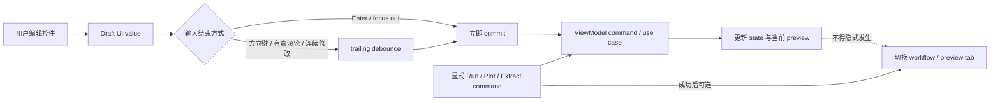

# UI 参数提交与导航契约

- **Status**: Current
- **Scope**: 所有 PyQt workspace、dialog 和可编辑参数控件的提交、刷新与导航行为
- **Related code**:
  [`src/gimap/app/presentation/parameter_commit.py`](../../src/gimap/app/presentation/parameter_commit.py)、
  [`src/gimap/app/presentation/components/numeric_inputs.py`](../../src/gimap/app/presentation/components/numeric_inputs.py)
- **Related tests**:
  [`tests/test_parameter_commit_coordinator.py`](../../tests/test_parameter_commit_coordinator.py)、
  [`tests/test_fitting_presentation.py`](../../tests/test_fitting_presentation.py)
- **Last verified**: 2026-08-20

## 目的

参数编辑、科学计算和页面导航是三种不同职责。过去把它们直接串在同一个 Qt signal 后，会出现
“只改 center 却跳到 Fit result”、滚动页面误改数值、连续按方向键反复执行昂贵计算等问题。
所有页面统一采用以下事件流：

## 数值控件规则

- 输入框按 Enter 或结束编辑时应立即提交当前有效值；如果相同 draft 已提交，不重复执行 command；
- 方向键、按钮箭头和有意的滚轮修改使用 trailing debounce，默认静默窗口为 `220 ms`，一组连续
  修改只提交最后值；
- 普通滚轮必须用于页面滚动。数值框只有在已获得焦点且按住 Alt/Option 时才接受滚轮改值；
- 轻量、纯显示 preview 可以最多每 `60 ms` 刷新一次，但 scientific commit 仍按上述规则执行；
- 程序加载 session、同步单位或回填 ViewModel state 时必须 block signals，不能伪装成用户修改；
- 同一组互相约束的参数应作为一个 commit group，例如 energy/wavelength 或 center/cut geometry；
- `ParameterCommitCoordinator` 只负责 Qt 事件合并。它不得包含 scientific calculation、I/O 或
  feature-specific 判断。

默认时间是交互基线，不是所有 operation 的强制耗时。纯样式变化可立即渲染；超过约 `100 ms`
或可能阻塞 GUI 的工作必须进入 application command/JobRunner，不能靠加大 debounce 掩盖阻塞。

## 参数影响分级

| 参数类型 | 示例 | 提交后行为 |
| --- | --- | --- |
| Display state | colormap、vmin/vmax、Log intensity、overlay | 只刷新当前显示，不使科学结果失效 |
| 轻量 scientific state | center、cut geometry、sampling | 更新 ViewModel；已有 cut 时防抖重算该 cut |
| Experiment setup | detector distance、pixel size、wavelength | 更新 setup；已有 cut 时按新坐标防抖重算 |
| Model state | component/global 参数 | 更新模型 draft；已有 fitting input 时可防抖重绘模型 |
| 长任务 | AI fitting、refinement、batch、simulation | 只能由显式 command 启动并通过 JobRunner 执行 |

参数分类必须与
[`scientific-data-flow.md`](scientific-data-flow.md) 一致。DisplayState 不得触发 cut/fitting；
preprocessing 或 experiment setup 改变时，依赖旧 revision 的结果必须失效或重算，不能继续显示成
“最新结果”。

## 导航所有权

- workflow step selection、workflow completion 和右侧 preview tab 是三份独立状态；
- 点击左侧步骤只改变左侧任务内容，不得重置 Detector/Curve 等右侧工作视图；
- 参数 commit、自动刷新、鼠标选 center/region 不得改变 tab、scroll position、keyboard focus，
  也不得打开 dialog；
- 显式 `Extract Cut`、`Plot Current Model`、`Run`、`Predict` 等 command 只有在产生有效结果后，
  才可以把对应结果页揭示给用户；失败时必须留在原处并显示就地反馈；
- 自动刷新已有结果时必须保持用户当前 view。若结果尚不存在，参数修改不能替用户启动新工作流；
- Guided/Compact 只能改变说明密度，不能改变命令可达性、科学状态或导航规则。

## Fitting 当前实现

Fitting 的右侧工作区只有稳定的 `Detector` 与 `Curve` 两页。`Curve` 在一个 canvas 上通过
`Data only / Compare / Model only` 控制图层，不再为 cut 与 fit 建立两个会互相抢占的页面。左侧
`Import data / Experiment setup / Yoneda & cut / Fit` 只负责定位任务。显式 cut 或显式 plot 成功
后可以进入 Curve；已有 cut 的参数更新会防抖重算，但始终保留用户正在查看的右侧页面。

## Review 清单

- Enter、方向键、Alt/Option + wheel、focus out 是否分别测试；
- 快速连续修改是否只提交最终值，GUI 是否保持响应；
- 参数刷新是否意外切 tab、滚动、抢焦点或弹窗；
- 显式 command 失败时是否保持原页面；
- 自动刷新是否只在已有派生结果时发生；
- application/domain 是否仍然不依赖 Qt timer 或 widget；
- offscreen tests 是否覆盖 View、ViewModel state 与 public import aliases。
