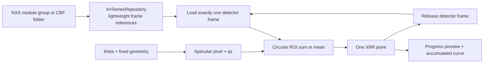

# XRR series extraction scientific contract

- **Status**: Current
- **Scope**: GIWAXS/GISAXS NXS and CBF angle series used to extract specular XRR points
- **Related code**:
  [`src/gimap/features/xrr/`](../../src/gimap/features/xrr/)、
  [`src/gimap/shared/detector_io/`](../../src/gimap/shared/detector_io/)
- **Related tests**:
  [`tests/test_xrr_domain.py`](../../tests/test_xrr_domain.py)、
  [`tests/test_xrr_application.py`](../../tests/test_xrr_application.py)、
  [`tests/test_xrr_adapters.py`](../../tests/test_xrr_adapters.py)、
  [`tests/test_xrr_job_smoke.py`](../../tests/test_xrr_job_smoke.py)
- **Last verified**: 2026-08-25

## Purpose and ownership

XRR extraction is an independent Tools workflow. It reuses the shared detector-file loader but owns
its angle-series semantics, specular geometry, ROI definition, streaming workflow and CSV result.
It does not call WAXS or Fitting presentation, ViewModels, controllers or adapters.



## Series semantics

- Selecting one P03-style NXS module such as `scan_m7.nxs` discovers the sibling module group and
  reuses `shared.detector_io.load_detector_image`. For each frame index, all modules are stitched with
  the same translation, mask and orientation rules used by GIWAXS. If the module group has `n`
  detector frames, it produces exactly `n` XRR points, not `modules × n` points.
- A CBF series is one frame per file. Files matching the chosen glob are ordered by natural filename
  order, so `scan_2.cbf` precedes `scan_10.cbf`.
- Linear angle mode uses `theta_i = theta_start + i × theta_step`, where `i` is zero-based series
  order. NXS dataset mode requires one motor value per detector frame. Dataset units `rad` and `mrad`
  are converted to degrees; other units are interpreted as degrees.
- CBF series currently use linear angle mode because detector CBF headers do not provide a reliable
  sample-table series vector.

## Fixed-detector specular geometry

The synchrotron beam and detector are fixed; only the sample table rotates by `theta`. The direct-beam
center is the detector position at `theta = 0`. The specular reflection appears at detector scattering
angle `2 theta`:

```text
wavelength_A = 12.398419843320026 / energy_keV
qz_A^-1      = 4 pi sin(theta) / wavelength_A
x_specular   = beam_center_x
y_specular   = beam_center_y + direction × distance_m × tan(2 theta) / pixel_size_y_m
```

`direction` is explicitly selected as detector up (`-1`) or down (`+1`) because installed detector
orientation differs between experiments. Pixel coordinates use the established displayed detector
orientation: x grows right and y grows down. The beam center can be entered numerically or picked on
the first detector preview.

## Intensity definition

The extraction ROI is a circle centered on the calculated specular pixel:

- radius `0` selects the nearest single detector pixel;
- radius `r > 0` selects pixel centers whose Euclidean distance from the fractional specular center is
  at most `r` pixels;
- non-finite values and detector-mask pixels are excluded;
- `Sum` returns the sum of valid selected pixels; `Mean` returns their arithmetic mean;
- an ROI completely outside the detector or without valid pixels produces a missing intensity and a
  valid-pixel count of zero. CSV represents this intensity with an empty field.

No exposure normalization, incident-flux normalization, footprint correction, background subtraction,
polarization correction, or resolution correction is applied. Adding any of those operations changes
the scientific contract and requires explicit UI, documentation and numerical regression tests.

## Memory, progress and display

The worker expands lightweight frame references, then loads, measures and releases one full detector
frame at a time. It never returns a detector stack. Progress transports one bounded, downsampled
display projection plus one scalar point; the final result contains only point records.

The downsampled live preview is display-only. It must never be used for ROI extraction or CSV output.
The circular ROI is evaluated on the full detector frame. `Live frame` and `XRR points` are independent
presentation tabs: progress may update both projections but must not change the tab selected by the user.
