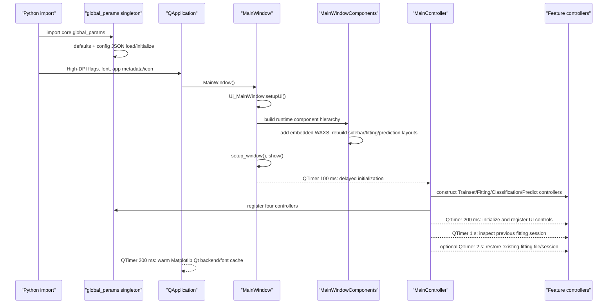
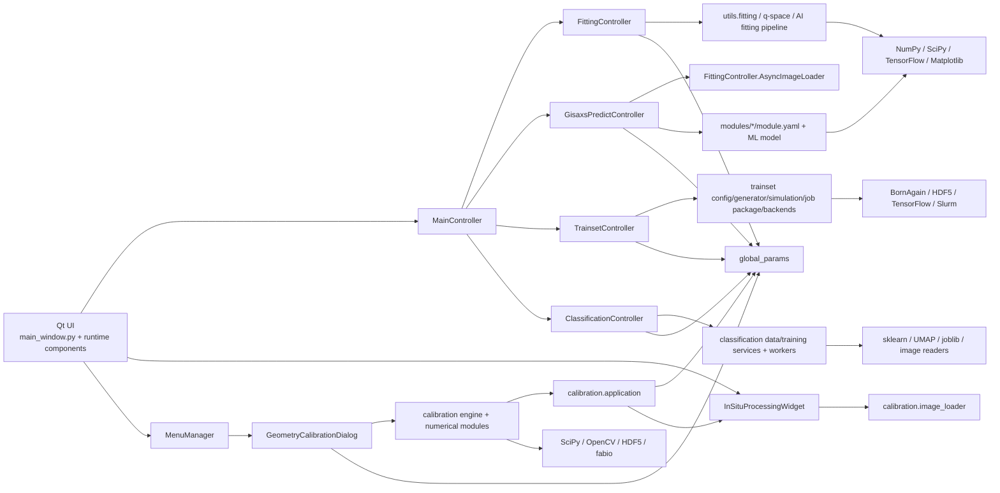

# GIMaP 重构前架构基线

- 审计日期：2026-08-16
- 审计范围：当前仓库的 Python 源码、UI 定义、配置结构、文档与现有测试。
- 审计方式：只读静态追踪、文件规模/重复性比较、`gui` Conda 环境依赖清单核对；未启动 GUI、未执行计算任务，也未改动源码、配置或依赖。
- 本文用途：在重构前冻结“入口、调用关系、外部契约和用户可见行为”。“当前可运行”表示代码路径可达、所需依赖在当前环境可见，或已有自动测试佐证；不等同于本次审计重新完成了全部端到端验收。

## 0. 结论摘要

GIMaP 目前是一个以 PyQt5 `MainWindow` 为中心的模块化单体。页面看起来已经按功能拆分，但实际边界不一致：calibration 和 classification 已有相对清楚的 service/model 层；trainset 也有独立领域包；fitting、prediction 和 WAXS 仍把 UI 编排、状态、计算、线程、文件 I/O、绘图与导出集中在 controller 或 page 中。

当前最关键的结构事实如下：

1. `main.py` 创建生成式 UI，再由 `MainWindowComponents` 在运行时重新组织布局、替换/追加页面，最后由 `MainController` 创建四个主 controller。WAXS 没有 controller，直接以 widget 形式嵌入。
2. `FittingController` 为 18,230 行，是最大风险集中点；`GisaxsPredictController` 直接导入其内部的 `AsyncImageLoader` 和可用性检查函数，形成跨 feature 的反向依赖。
3. `global_params` 同时承担参数仓库、JSON 持久化、controller 注册表、Qt 控件注册表和信号总线职责，并在 import 时产生配置目录/文件读写副作用。
4. calibration 的计算包分层较好，但 `calibration/application.py` 同时写 `global_params` 和直接更新 WAXS 控件。
5. WAXS 有嵌入式 `ui/waxs_page.py` 与旧版 `WAXS/WAXS.py` 两套实现；`controllers/waxs_controller.py` 为空文件。
6. 现有 78 个测试集中在 calibration、trainset、fitting 图像处理和 AI fitting 规则；主窗口启动、导航、prediction、classification、嵌入式 WAXS 缺少 characterization tests。

## 1. 应用启动和初始化流程

### 1.1 启动链

入口为 `main.py:290 main()`：

详细顺序：

1. `main.py:1-3` 先设置默认 `MPLBACKEND=Qt5Agg`。
2. import `core.global_params` 时即创建 `GlobalParameterManager` 单例。其构造函数初始化内存默认值，确保 `config/`、`default_parameters.json`、`user_parameters.json` 存在，并读取用户参数。因此“参数初始化”早于 `QApplication`，且依赖当前工作目录。
3. `main()` 设置 Qt 高 DPI 属性，创建 `QApplication`，设置字体、应用名称、版本、组织与图标。
4. `MainWindow.__init__` 调用生成代码 `Ui_MainWindow.setupUi()`，随后创建 `MainWindowComponents`。
5. `MainWindowComponents` 清理生成 UI 的部分 inline style，创建嵌入式 WAXS 页、侧栏、content stack，并重组 fitting/prediction workspace，应用响应式样式和窗口 profile。
6. 窗口显示后，`MainWindow` 的 100 ms timer 创建 `MenuManager` 和 `MainController`。
7. `MainController.__init__` 延迟 import 并立即实例化 `TrainsetController`、`FittingController`、`ClassificationController`、`GisaxsPredictController`，注册到 `global_params`，连接导航和状态信号。
8. 200 ms timer 调用 `_delayed_controller_initialization()`。其中 `_initialize_ui()` 已初始化四个 controller，随后又调用四次 `initialize()`；目前各 controller 的 `_initialized` guard 使第二次调用成为幂等跳过。该双调用是现状，不应被误认为两个独立初始化阶段。
9. 默认页面固定为 Cut & Fitting，stack index 为 `2`。页面映射为 Trainset `0`、Prediction `1`、Fitting `2`、Classification `3`，WAXS 为运行时追加的动态 index。
10. 1 秒后读取 `fitting.last_session`；若 `last_opened_file` 仍存在，再延迟 2 秒调用 `FittingController.restore_session()`。
11. 窗口关闭时，`MainController` 保存 fitting session 到 `global_params`/`config/user_parameters.json`，`MainWindowComponents` 保存 splitter/sidebar 等 UI 状态到 `user_settings`。

### 1.2 启动期边界与风险

- import `global_params` 会读写相对路径 `config/...`，所以从非仓库工作目录启动可能读写错误位置。
- UI 有三层事实来源：`ui/main_window.ui`、生成文件 `ui/main_window.py`、运行时重排 `ui/components/main_window_components.py`。仅修改其中一层不一定改变最终界面。
- `MainController` 是四个 controller、页面导航、session 和全局控件注册的 composition root，但 WAXS 与 calibration 没有按同一方式注册。
- 初始化异常主要被捕获、打印并继续启动；用户看到的可能是“应用已打开但部分功能不可用”，而不是进程失败。

## 2. 六个功能入口

| 功能 | 用户入口与页面 | 代码入口 | 下游主路径 | 主要 I/O / 外部依赖 |
|---|---|---|---|---|
| fitting | 左侧 **Cut & Fitting**；stack `2`；生成页再由 `GisaxsFittingWorkspace` 重排 | `MainController._switch_to_cut_fitting()` → `FittingController.initialize()` / `_setup_connections()` | 图像加载/stack → 显示和 mask → q 空间与 cut → `utils.fitting` 手动模型 → SciPy least-squares Auto Refine；AI 路径经 `utils.ai_fitting_*` 和独立进程 | CBF/NXS/TIFF/1D 文本、fabio、h5py、NumPy、SciPy、Matplotlib、TensorFlow/Keras、JSON/CSV/图像导出 |
| prediction | 左侧 **GIMaP Predict**；stack `1`；`GisaxsPredictWorkspace` 重排 | `MainController._switch_to_gisaxs_predict()` → `GisaxsPredictController._run_gisaxs_predict()` | `modules/*/module.yaml` discovery → input/stack loader → module preprocessing/mask → Keras/SavedModel inference → 单文件或 `MultiFilePredictionManager` 批处理 → tabs/export | CBF、`.npy` mask、YAML、TensorFlow/Keras、fabio、NumPy、Matplotlib；JSONL/JPG/ASCII/结果文件 |
| trainset | 左侧 **Trainset Build**；stack `0` | `TrainsetController.__init__()` 用 `TrainsetBuildPage` 替换生成页；`initialize()` | config → reference/ROI/mask/preview → `DatasetGenerator`/`simulation` → HDF5 shards；或 `prepare_job_package()` → LocalBackend/SlurmBackend → training/metrics/model registration | CBF/NXS/TIFF/HDF5/YAML/JSON；BornAgain 24.1、OpenCV、SciPy QMC、TensorFlow；本地 subprocess、SSH/rsync/scp/Slurm |
| classification | 左侧 **Classification**；stack `3` | `ClassificationController._install_page()` 创建 `ClassificationPage`，`initialize()` 恢复状态 | source scan/load/QC → feature matrix → QRunnable workers → sklearn 多算法/降维/验证 → 排名与图表 → joblib model → 新数据预测 | 1D 文本、图片、CBF/EDF、HDF5、NPY；NumPy、h5py、fabio、OpenCV、scikit-learn、UMAP、joblib、Matplotlib |
| WAXS | 左侧 **WAXS**；`MainWindowComponents` 运行时追加 page | `MainController._switch_to_waxs()` → `InSituProcessingWidget`；没有有效 WAXS controller | widget 内部 load worker → display/mask/geometry/ROI/cut/integration → batch worker → export | NXS/TIF/TIFF、共享 calibration loader、h5py/Pillow、NumPy、Matplotlib、CSV/图像 |
| calibration | **Tools > Geometry Calibration...**，`Ctrl+Shift+G`；modeless dialog | `MenuManager.open_geometry_calibration()` → `GeometryCalibrationDialog` → `CalibrationWorker` → `CalibrationEngine.calibrate()` | image loader/metadata → preprocess → center candidates → radial profile/peak detection → standard matching → least-squares refine/rank → JSON import/export → Apply | NXS/CBF/TIFF、h5py/fabio/Pillow、NumPy/SciPy/OpenCV；写 global params 并直接刷新 WAXS |

补充现状：

- `fitStartButton` 连接到 `FittingController._start_fitting()`，但其下游 `_run_fitting_process()` 当前为 `pass`。当前实际拟合能力来自 **Manual Fitting**、**Auto Refine** 和 **AI Auto Fitting** 路径。此空路径应当作为已知缺口记录，而不是被当作有效工作流。
- README 把 Trainset Build 标记为 “Not implemented”，但当前 controller、领域包、本地/Maxwell 作业和测试均已存在。它应被视为“实验性且文档状态过期”，不是完全空白功能。
- `controllers/waxs_controller.py` 和 `DataSetGenerator/saxsGenerator.py` 都是 0 行占位文件，不是当前入口。

## 3. UI、controller、计算、文件读写和外部依赖的调用关系

### 3.1 总体调用图

### 3.2 各功能的实际分层程度

#### fitting

- UI：`ui/main_window.py` 定义控件，`GisaxsFittingWorkspace` 将控件重新装入 card/splitter。
- controller：`controllers/fitting_controller.py` 同时包含纯图像函数、多个 QThread worker、独立绘图窗口、display manager、文件扫描/加载、session、参数编辑、cut、manual fit、Auto Refine、AI fitting、in-situ 和导出。
- 计算：部分在 `utils/fitting.py`、`utils/q_space_calculator.py`、`utils/ai_fitting_*`；但大量计算和数据转换仍在 controller 内。
- I/O：controller 直接打开/保存 CBF、NXS、1D 文本、JSON、CSV、图像和 session。
- 依赖方向问题：prediction 从 fitting controller 导入 `AsyncImageLoader`、`is_matplotlib_available`、`is_fabio_available`，说明共享基础设施没有独立边界。

#### prediction

- UI/controller/预处理/模型兼容 shim/绘图/export 基本集中在 4,701 行 controller。
- module contract 由 `modules/<name>/module.yaml` 提供：framework、model path、preprocess entry/steps/params、input shape/type、outputs 等。
- 模型导入可把新 `model_path` 写回 `module.yaml`；模型加载在 Python thread 中进行，预测包含 Keras model 和 raw SavedModel signature 的兼容路径。
- multi-file 管理和结果窗口部分抽到 `controllers/multifile_predict_results.py`，但单文件与批处理仍回调 controller 内的 `_predict_single_file_for_batch()`。

#### trainset

- `TrainsetController` 主要做 Qt 编排、配置收集、预览调度、本地进程/Slurm 操作。
- `trainset/config.py` 负责 schema/default/validation；`generator.py` 负责 reference、mask、sampling、preprocessing 和 HDF5；`simulation.py` 负责 BornAgain sample/detector/simulation；`job_package.py` 生成可移植作业；`backends.py` 封装本地与 Slurm 命令；`modeling.py` 负责 TensorFlow 模型兼容。
- 这是当前最接近“UI adapter → application/controller → domain/service → infrastructure”的功能，但 controller 仍有 1,837 行，并直接操作 QProcess、文件对话框和部分 TensorFlow validation。

#### classification

- `classification_models.py` 提供 dataclass/enum；`classification_data_service.py` 负责扫描、读取、QC、预处理和 feature matrix；`classification_training_service.py` 负责 sklearn pipeline、split、评估和排名；`classification_workers.py` 提供可取消 QRunnable。
- controller 仍负责页面安装、dialogs、状态机、图表绘制、CSV/session/joblib I/O，但核心数据与训练已可脱离 Qt 测试。

#### WAXS

- 当前入口没有 controller/service：`ui/waxs_page.py` 同时定义 DTO、load/batch workers、Matplotlib viewer、widget、积分、geometry、cut 与 export。
- 图像读取已经复用 `calibration.image_loader`，这是有价值的共享契约；但其余计算仍与 widget 绑定。
- 旧 `WAXS/WAXS.py` 仍是可独立运行的另一套 UI/loader/batch 实现，主 GUI 明确不实例化它。

#### calibration

- `calibration/` 内的 models、loader、preprocessing、center estimator、radial profile、peak detector/matcher、optimizer、ranker、serialization 和 engine 形成清晰计算流水线，且 `CalibrationEngine` 不依赖 Qt。
- `ui/geometry_calibration_dialog.py` 包含 Qt worker、参数表单、候选展示、手动 ring 编辑、Apply 与 import/export。
- `calibration/application.py` 是边界穿透点：把结果写入 detector/fitting/beam/system，并通过 `main_window.components.waxs_page` 直接设置 WAXS spinbox 和 refresh。

## 4. `global_params` 的使用范围

### 4.1 它当前承担的职责

`core/global_params.py` 中的进程级单例当前同时承担：

1. 九个顶级 section 的内存参数仓库：`beam`、`detector`、`sample`、`preprocessing`、`trainset`、`fitting`、`gisaxs_predict`、`classification`、`system`。
2. 点号路径的 nested get/set 与 module-level get/set。
3. `parameters_updated`、`parameter_changed` Qt signals。
4. trainset/fitting/classification/prediction controller 注册与双向同步。
5. 递归注册 QLineEdit/QSpinBox/QComboBox 等真实 widget，并缓存/设置 UI 值。
6. `config/default_parameters.json`、`config/user_parameters.json` 的创建、读取、保存、reset，以及任意参数 JSON import/export。
7. fitting last session 与 calibration summary 等运行状态保存。

### 4.2 直接消费者

直接 import 单例的生产代码包括：

- `main.py`
- `controllers/main_controller.py`
- `controllers/fitting_controller.py`（调用最密集，约 73 处相关调用）
- `controllers/gisaxs_predict_controller.py`
- `controllers/trainset_controller.py`
- `controllers/classification_controller.py`
- `ui/menu_manager.py`
- `ui/detector_parameters_dialog.py`
- `ui/geometry_calibration_dialog.py`
- `calibration/application.py`
- `utils/parameter_access.py`
- `utils/universal_parameter_trigger_manager.py`

`tests/test_calibration.py` 也直接使用它验证 calibration Apply。

### 4.3 并行存在的其他状态/持久化系统

- `core/user_settings.py` 的全局 `user_settings` 保存窗口尺寸、响应式布局、splitter/sidebar、AI Auto Refine UI 状态等到 `config/user_settings.json`。
- `config/model_parameters_manager.py` 专门保存 fitting 粒子/全局模型参数到 `config/model_parameters.json`；`MainController` 的参数 export/import 还会直接访问其 `_parameters`。
- feature controller 自己保留 `current_parameters`、当前文件/数组/model/worker/session 等内存状态。
- `utils/parameter_access.py` 又提供一层全局访问 facade；其中 `force_save_parameters()` 调用了 `global_params.force_save_parameters()`，但后者在当前 manager 中不存在，是潜在失效 API。

因此同一个用户概念可能分布在 global parameters、user settings、model parameters 和 controller state 中。重构前必须先用测试锁定每种数据的 owner、写入时机、单位与兼容格式，不能只按变量名合并。

### 4.4 当前同步特点

- `MainController` 只注册四个主 controller；WAXS/calibration 不参与统一 controller sync。
- calibration 把 distance/center/pixel size 同时写入 `detector` 和 `fitting.detector`，并另写 beam/system；这是有意的跨工作流同步行为。
- controller 参数通常在 UI change 或 action 时写入并调用 `save_user_parameters()`；关闭应用还会保存 fitting session。
- `get_module_parameters()` 返回手工深拷贝，但 widget registry 和 controller registry 保存真实对象引用。

## 5. 超大文件、重复实现与占位代码

### 5.1 主要超大文件

当前仓库约 79,370 行 Python（包含已提交的 trainset job snapshot）。最大的生产文件如下：

| 文件 | 行数 | 集中职责 / 风险 |
|---|---:|---|
| `controllers/fitting_controller.py` | 18,230 | UI、worker、读取、图像处理、q/cut、拟合、AI、in-situ、session、绘图、export；任何小改动都可能跨工作流回归 |
| `controllers/gisaxs_predict_controller.py` | 4,701 | UI、module YAML、预处理、TensorFlow compatibility、推理、绘图、单/批处理、export |
| `ui/main_window.py` | 4,108 | 由 `.ui` 生成；不适合作为手工业务逻辑 owner |
| `WAXS/WAXS.py` | 3,740 | 旧独立 WAXS 应用的 UI、loader、计算、batch |
| `ui/components/main_window_components.py` | 3,232 | 在生成 UI 之上再次构建大量 UI component/layout，且同时覆盖多个 feature |
| `ui/trainset_build_page.py` | 2,402 | 单页面中包含大量表单、preview 与 job UI |
| `ui/waxs_page.py` | 2,012 | 嵌入式 WAXS 的 UI、worker、计算、I/O |
| `utils/ML_Fitting_1D_GISAXS/Training/predict_topk.py` | 1,932 | AI fitting CLI/pipeline 实现之一 |
| `utils/predict_topK.py` | 1,845 | 另一份相似但已分叉的 top-K 实现 |
| `controllers/trainset_controller.py` | 1,837 | UI 编排、本地/HPC job、preview 和模型注册 |
| `controllers/classification_controller.py` | 1,807 | 页面状态、dialogs、worker 调度、绘图、session/model/export |
| `ui/geometry_calibration_dialog.py` | 1,094 | calibration 的完整交互与 worker orchestration |
| `controllers/multifile_predict_results.py` | 1,091 | prediction batch UI/状态/export |

### 5.2 重复/分叉实现

| 范围 | 证据 | 审计判断 |
|---|---|---|
| WAXS | `ui/waxs_page.py` 与 `WAXS/WAXS.py` | 两套 UI、loader、batch/处理逻辑；当前主 GUI 只走前者，旧文件仍可独立运行，容易产生修复漂移 |
| AI top-K | `utils/predict_topK.py` 与 `utils/ML_Fitting_1D_GISAXS/Training/predict_topk.py`，分别 1,845/1,932 行且 hash 不同 | 明确分叉；测试导入的是 `Training.predict_topk`，另一份也引用物理 fitting，必须先判定权威实现 |
| fitting physics | `utils/fitting.py` 与 `utils/ML_Fitting_1D_GISAXS/utils/fitting.py`，hash 不同 | root controller 用前者；job/training scripts 可能通过不同 `PYTHONPATH` 使用后者，存在模型训练/GUI 验证物理不一致风险 |
| Trainset/calibration snapshot | `trainset_jobs/gisaxs_2d_project/src/{trainset,calibration}` 复制 root package；33 个文件已提交，部分相同、部分已漂移 | 这是 `prepare_job_package()` 的有意可移植快照，但提交后成为第二份源码；应以 manifest/hash 作为生成物契约，避免手改两份 |
| UI source | `ui/main_window.ui` → `ui/main_window.py` → `MainWindowComponents` runtime reparent/rebuild | 不是字面复制，但相同布局职责有三个事实来源；重构前需通过 UI tests 固定最终树和 objectName |
| 参数访问 | `global_params` convenience functions、`utils/parameter_access.py`、各 controller 的 get/set、`ModelParametersManager` | facade 和持久化职责重复，且存在失效转发 API |

此外：

- `controllers/waxs_controller.py` 和 `DataSetGenerator/saxsGenerator.py` 为 0 行占位。
- `config/` 同时包含 default、user、backup、test、my 参数 JSON；它们用途不同但命名不能清晰表达运行时 owner。
- `FittingController._run_fitting_process()` 是已连接按钮下的空实现；这类“可达占位”应由 characterization test 明确暴露。

## 6. 当前可运行的关键用户工作流

### 6.1 本次环境快照

当前 `gui` Conda 环境可见的关键版本：Python 3.10.20、PyQt5 5.15.11、NumPy 1.26.4、SciPy 1.15.3、Matplotlib 3.10.9、OpenCV 4.11.0、h5py 3.16.0、fabio 2025.10.0、BornAgain 24.1、TensorFlow 2.15.1/Keras 2.15.0、scikit-learn 1.7.2、UMAP 0.5.12、joblib 1.5.3。

这说明六个功能的主要 Python 依赖在环境中存在。`lmfit`、`nexusformat` 未安装，但当前审计到的主调用链不以它们为必需入口。

### 6.2 工作流与可信度

| 工作流 | 当前可达步骤 | 佐证与限制 |
|---|---|---|
| 应用启动/导航 | `python main.py` → 默认 Cut & Fitting → 五个左侧页面 → Tools dialogs → 关闭保存 | 静态链清晰且依赖存在；本次未做 GUI runtime smoke；无启动/navigation 自动测试 |
| Detector → cut → manual fit | 导入 CBF/NXS/TIF/TIFF 或 1D → stack/frame navigation → threshold/flip/mask/display → center/cut/q → Manual Fitting → export | fitting 栈、mask、flip、q sampling 有 15 个 tests，物理模型另有测试；`fitStartButton` 通用 Start 路径为空，不计为有效拟合步骤 |
| Auto Refine / AI Auto Fitting | 当前曲线/uncertainty → Fast/Balanced/Exhaustive → candidate constraints → 独立进程 → optional least-squares refine → candidate preview/export | profiles、pipeline path、model registry、constraints、curve loader、in-situ compatibility 有测试；完整 GUI run 未覆盖 |
| Prediction 单/多文件 | 选择 module → 输入/stack/range → import/load Keras/SavedModel → preprocess → predict → tabs → current/all export | 静态实现完整且 TF/fabio/YAML 存在；没有 feature-level 自动测试，module/model/真实数据组合需要 characterization fixture |
| Trainset preview/generate/train | reference → beam/detector/sample/ROI/mask → BornAgain preview → HDF5 shards → local generation/training/smoke；或打包上传 Maxwell/Slurm、同步结果、注册最佳 model | BornAgain 24.1 已安装；15 个 tests 覆盖 grid cache、参数/约束、噪声/mask、orientation、job package；本地完整生成和远程 Slurm 未在本次执行，README 状态落后 |
| Classification | 建立类别/source → scan/import/QC → 1D/2D preview/preprocess → PCA/UMAP/t-SNE → 多 sklearn 算法共享验证 → 排名/混淆矩阵 → joblib save/load → 新数据预测/export | 代码分层和依赖完整；目前没有自动测试，真实兼容性尤其依赖保存包内的 sklearn/NumPy 版本和 feature preprocessing |
| 嵌入式 WAXS | 打开 NXS/TIF/TIFF → frame/display/mask → geometry/ROI/line/circle cut → 1D integration → CSV/图像 → folder batch/pause/stop | 静态可达，共享 NXS loader 的 orientation 由 calibration/trainset tests 间接覆盖；WAXS 自身无 tests，旧/新实现结果一致性未知 |
| Geometry calibration | Tools 打开 → NXS/CBF load → standard/energy/options → background worker/cancel → candidates/manual rings → Apply → JSON import/export | 19 个 tests 覆盖 loader/orientation/mask、center、matching/ranking、serialization、Apply、full synthetic engine 和 dialog layout；六个功能中测试基线最强 |

## 7. 重构时必须保持不变的行为

以下是应优先冻结的外部行为。它们描述契约，不要求保留当前类、文件或重复实现。

### 7.1 启动、导航和状态恢复

- `python main.py` 保持有效；Qt5/Matplotlib backend、高 DPI、应用图标和响应式布局仍可用。
- 默认打开 Cut & Fitting；五个侧栏项仍到达正确页面，WAXS 仍嵌入主窗口而不是另开旧窗口。
- controller 初始化对用户只发生一次，延迟加载不能阻塞首屏；可选依赖/单个 feature 失败时应用仍能打开并给出可理解状态。
- fitting 最后文件/session、全局参数、窗口/sidebar/splitter 与 model parameters 的既有 JSON 能继续读取；关闭时保存时机和用户可见结果不倒退。

### 7.2 文件、数组方向和单位

- CBF、NXS module series、NXS internal frames、standalone NXS、TIF/TIFF 与 1D 文本的当前导航和 stack clamp 语义不变。
- 共享 NXS loader 的 GIWAXS/GISAXS orientation、mask bit 处理、CBF 不额外翻转的语义不变；BornAgain pattern 当前 `flipud` 后进入 GUI/dataset 的方向不变。
- fitting threshold 把无效/out-of-range pixel 变为 NaN；这些像素在 integration mean 和 center profiles 中权重为零；flip 只应用一次。
- q 坐标、重复 q 合并、negative-only filter 与 interpolation 的顺序不变。
- calibration Apply 的单位映射不变：distance 为 mm、pixel size 写入 µm、beam center 为 px、`beam.wavelength` 为 nm；WAXS wavelength 控件显示 Å。

### 7.3 fitting / AI fitting

- sphere、random cylinder、vertical cylinder 的现有参数含义、D 约束、distribution width 语义、forward-model 数值结果与 simpler-K/hybrid ranking 不变。
- Fast/Balanced/Exhaustive 默认参数、Balanced 默认选择、编辑后显示 Custom、seed 可复现、time budget/cancel/progress 与 in-situ 复用同一 pipeline 的行为不变。
- Manual Fitting、Auto Refine 的 fixed/free、bounds、background/resolution/scale、uncertainty weighting 与导出内容保持兼容。
- 当前空的通用 Start 路径属于需显式决策的缺口，不应在无产品决定时悄悄赋予不同语义；它也不应阻止保护真正可用的三条拟合路径。

### 7.4 prediction

- `module.yaml` contract、modules discovery、每个 module 独立 model path、preprocess steps/params、mask、input shape/rank coercion 和 output tab mapping 不变。
- Keras 文件与 SavedModel directory 的兼容加载、lazy model load、CPU float32 fallback、single 与 multi-file 对同一输入产生一致结果。
- JSONL/JPG/ASCII 等现有批量导出 schema、文件选择顺序、stack/range/every 规则和取消状态保持兼容。

### 7.5 trainset

- config schema/default/validation、parameter sampling 和 seed 可复现性不变。
- reference ROI/mask、threshold 与 random mask 合并、Gaussian/Poisson noise 独立性、qz display 方向和 BornAgain physical constraints 不变。
- HDF5 shard datasets/shape/dtype/metadata、job package layout、environment pin（BornAgain 24.1、TF/Keras 2.15）、manifest hash 和 local/Slurm CLI 保持兼容。
- `prepare_job_package()` 刷新代码但保留 dataset/results/logs/cache 的行为不变。

### 7.6 classification

- source 去重、label、支持扩展名、1D/2D 不混用、QC 与 preprocessing 规则不变。
- 共享 validation folds、random seed、metric 定义、ranking metric、算法默认参数和 active-model 选择不变。
- joblib package 保留 pipeline、class names、preprocessing/projection、input shape、依赖版本与 metrics；旧 t-SNE model 不能用于 transform 新样本时继续明确拒绝。
- worker 的 busy guard、cancel/error 状态，以及 CSV/session/prediction exports 的字段保持兼容。

### 7.7 WAXS / calibration

- WAXS 单文件和 batch 对相同设置得到相同 cut/integration；log/color limits 只影响显示，不改变导出计算数据。
- line/circle/ROI selection、background subtraction、pause/stop、frame clamp 和 CSV headers 保持不变。
- calibration 的标准、中心在 detector 外和 partial arcs 支持、candidate ranking/confidence/residual、manual ring review、cancel 与 JSON round-trip 保持不变。
- Apply 必须原子地更新 detector/fitting/beam/system 并同步 WAXS；取消/关闭/低置信度 review 不应部分写入共享状态。

## 8. 推荐的 characterization tests

### 8.1 现有基线

仓库当前可检索到 78 个 test：calibration 19、trainset workspace 15、cut/fitting stack 15，其余覆盖 AI fitting constraints/pipeline/profiles/model registry/curve loader、in-situ AI compatibility、random-cylinder physics、format converter 和 ML training constraints。主要空白是启动/navigation、prediction、classification、WAXS 和跨 feature 状态同步。

### 8.2 P0：任何结构移动前先补

| 测试 | fixture / 隔离方式 | 必须锁定的断言 |
|---|---|---|
| Headless startup composition | `QT_QPA_PLATFORM=offscreen`，temp config cwd，禁用 session restore 文件 | MainWindow 可构造；四个 controller 各初始化一次；默认 stack=2；WAXS 动态页存在；菜单 action 存在；无 import-time 写入仓库 config |
| Navigation contract | Qt signal click 五个 sidebar button | page index/active sidebar/status text 一致；WAXS 不实例化 legacy MainWindow |
| Persistence round-trip | temp copies of default/user/model/user_settings JSON | defaults+user merge、nested set/get、controller sync、save/reload、旧文件缺字段、未知字段保留策略和单位不变 |
| Fitting golden workflow | 小型 CBF/NXS/TIFF/1D fixtures + frozen detector params | load→transform→q→vertical/horizontal cut→manual curve 的数组 golden；mask/flip/stack 行为与现有 tests 合并成端到端契约 |
| Fitting button routing | fake controller computation methods | Manual、Auto Refine、AI 按钮走各自路径；记录 `fitStartButton` 当前到达空实现，待产品决定后再更新期望 |
| Prediction module contract | 最小 `module.yaml`、deterministic fake Keras/SavedModel、`.npy` mask、三张输入 | discovery/parse/preprocess/input shape/output mapping；single 与 batch 每个文件结果逐项相同；model path 不跨 module 泄漏 |
| WAXS calculation parity | 小型 NXS/TIFF 与固定 geometry/mask/ROI | 单文件和 BatchWorker 的 background/cut/integration 数组、CSV header、方向和 frame selection 完全一致 |
| Calibration atomic Apply | synthetic `CalibrationResult` + fake WAXS controls + isolated global store | mm/µm/px/nm/Å 映射正确；五个 geometry 值同时写 detector/fitting；WAXS refresh 一次；cancel/failure 不写状态 |

### 8.3 P1：保护 feature 行为

| 测试组 | 建议案例 |
|---|---|
| Startup degradation | 缺 fabio/TensorFlow/BornAgain/UMAP 时主窗口仍打开；相应按钮 disabled 或出现明确错误，其他 feature 可用 |
| Session migration | 缺字段、旧 model parameter shape、失效 last file、Windows 路径在 macOS normalize 后的行为 |
| AI fitting | 三 profile golden request、同 seed candidate ordering、cancel/time budget、in-situ 与单曲线 request 等价、SavedModel fallback |
| Prediction I/O | CBF stack clamp、range parser、module preprocess plugin error、raw SavedModel signature、多输出、JSONL/ASCII schema golden、partial batch failure |
| Trainset | 最小 32×32 BornAgain simulation、固定 seed HDF5 checksum/contract、cache eviction、job package manifest、local subprocess args；SSH/Slurm 命令用 mock 验证，不连接真实 Maxwell |
| Classification data | 每种扩展名 reader、folder recursion/pattern、duplicate path、mixed 1D/2D、shape mismatch、NaN/empty/QC、resize/interpolation golden |
| Classification training | 固定小数据集和 seed；所有默认算法共享 folds；metric/ranking/confusion/misclassified golden；cancel；joblib save-load-predict 等价；依赖版本 warning |
| WAXS interaction | frame clamp、mask/display limits 分离、line/circle/ROI 几何、pause/resume/stop、失败文件后 batch 汇总、export image scale |
| Calibration | 在现有 19 tests 上增加 dialog Apply/cancel、低置信度/manual candidate、未知/部分 metadata、WAXS 同步和失败回滚 |

### 8.4 P2：防止重复实现再次漂移

1. 对同一 fixture 同时运行 root `utils/fitting.py` 与 training copy，比较所有公开 physics function 数值；若本就不同，先记录允许差异清单。
2. 对两份 `predict_topK` 用同一 request/seed/mock model 比较 request normalization、constraints、candidate schema 和 ranking。
3. 将 `prepare_job_package()` 生成到 temp directory，验证 copied `trainset/`、`calibration/` 与 source hash/manifest 一致；不要直接测试已提交 snapshot 的偶然内容。
4. 用相同 NXS/TIFF fixture 比较 legacy WAXS loader 与 embedded/shared loader 的数组方向、mask 与 integration；确定旧实现退役前的兼容边界。
5. 做 UI objectName contract test，确保从 `.ui` 生成和 runtime reparent 后 controller 需要的控件仍唯一存在。

### 8.5 测试执行原则

- 所有参数/config/session/model path 写入临时目录，不允许测试污染仓库 `config/`、`AI_Fitting_Output/` 或 `trainset_jobs/`。
- 数值 golden 同时保存输入、单位、array orientation、版本容差；不要只断言“没有异常”。
- 外部程序、Maxwell/Slurm、文件对话框、TensorFlow 大模型和 BornAgain 大网格在快速测试中使用小 fixture 或 mock；另设显式标记的 integration tests。
- characterization tests 先描述当前行为；若某行为被认定为 bug（例如空 Start 路径），用单独决策和测试变更修改契约，不在结构移动中顺带改变。

## 9. 重构前的验收闸门

本文不启动重构。进入任何代码移动前，至少应满足：

1. P0 测试已落地并在 Windows 与 macOS 的目标 Python/TensorFlow/BornAgain 组合运行。
2. 对三套参数持久化的 owner、schema、单位和 migration 策略有明确决定。
3. 对 root/training fitting physics、两份 top-K、两套 WAXS、trainset job snapshot 的权威来源有书面结论。
4. 每次拆分只改变一个 dependency seam，并用 golden/round-trip tests 证明用户可见行为未变。
